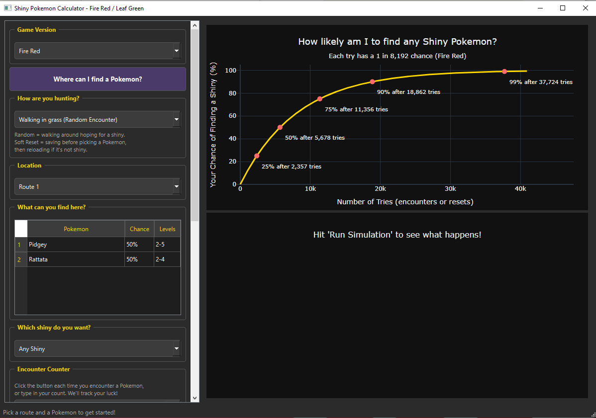
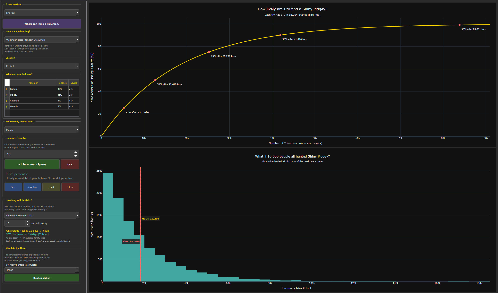
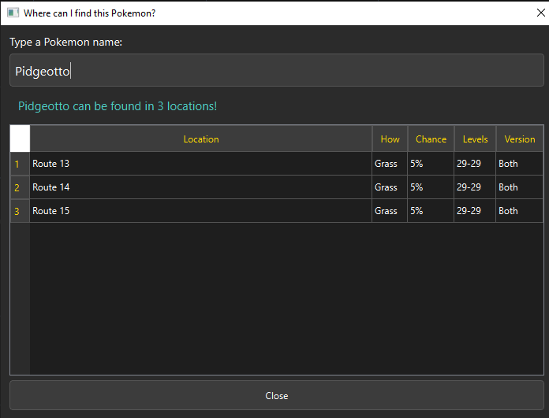
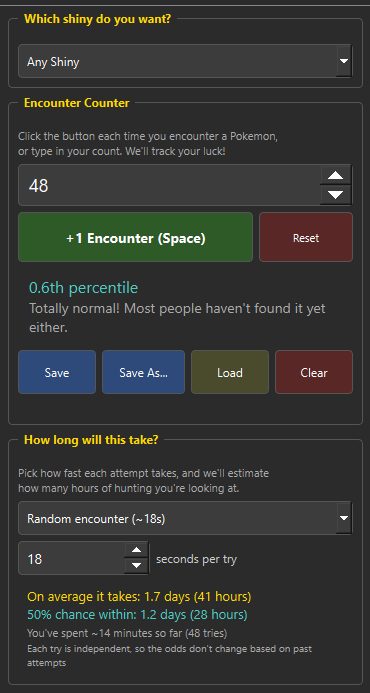

# Shiny Pokemon Calculator - Fire Red / Leaf Green

A desktop app that calculates your odds of finding a shiny Pokemon in Fire Red and Leaf Green, with Monte Carlo simulation to see how lucky (or unlucky) you might get.

## What it does

- **Probability charts** showing your cumulative chance of finding a shiny over time, with milestone markers at 25%, 50%, 75%, 90%, and 99%
- **Monte Carlo simulation** that runs thousands of virtual hunts so you can see the spread of outcomes
- **Encounter counter** with auto-save so you can track your progress across sessions
- **Time estimator** that tells you roughly how many hours your hunt will take
- **Pokemon search** that tells you where to find any Pokemon, including ones not available in FR/LG
- **Complete encounter data** for every route, cave, surf spot, and fishing rod in the game, pulled directly from the [pokefirered decompilation](https://github.com/pret/pokefirered)

## Screenshots

### Main view with probability chart


### Simulation results


### Pokemon search


### Encounter counter and time estimator


## Download

Go to the [Releases](https://github.com/wermusam/shiny_pokemon/releases) page and download the file for your system:

| Your computer | Download this file | How to run it |
|---|---|---|
| Windows | `ShinyPokemonCalculator-Windows.exe` | Double-click it |
| Mac | `ShinyPokemonCalculator-Mac.zip` | Double-click the zip to unzip it, then double-click the app. The first time, if macOS says it can't verify the app: open **System Settings → Privacy & Security**, scroll down, and click **Open Anyway**. |

No installation or Python needed. Just download and run.

## Run from source

Requires Python 3.13+.

```bash
# Clone the repo
git clone https://github.com/wermusam/shiny_pokemon.git
cd shiny_pokemon

# Install uv (Python package manager)
pip install uv

# Install the app and all dependencies
uv sync

# Run the app
uv run shiny-gui
```

## Run the tests

```bash
uv run pytest tests/ -v
```

All 63 tests should pass.

## How the math works

Every wild encounter in Gen 3 has a 1 in 8,192 chance of being shiny. If you're hunting a specific Pokemon (say Pidgey at 20% encounter rate), your effective odds per encounter are 1 in 40,960.

The probability of finding at least one shiny in N encounters follows the geometric distribution:

```
P(shiny in N tries) = 1 - ((odds - 1) / odds) ^ N
```

The simulation uses NumPy's geometric random number generator to run thousands of independent hunts and show you the distribution of outcomes.

## Data accuracy

All encounter tables were generated from the [pokefirered decompilation](https://github.com/pret/pokefirered) (`src/data/wild_encounters.json`), which is a byte-accurate reconstruction of the original game ROM. This is the actual game data, not from fan wikis.

The generation script (`generate_encounters.py`) is included if you want to verify or regenerate the data yourself.

## Built with

- [PySide6](https://doc.qt.io/qtforpython-6/) (Qt for Python) for the desktop UI
- [Plotly](https://plotly.com/python/) for interactive charts
- [NumPy](https://numpy.org/) for Monte Carlo simulation
